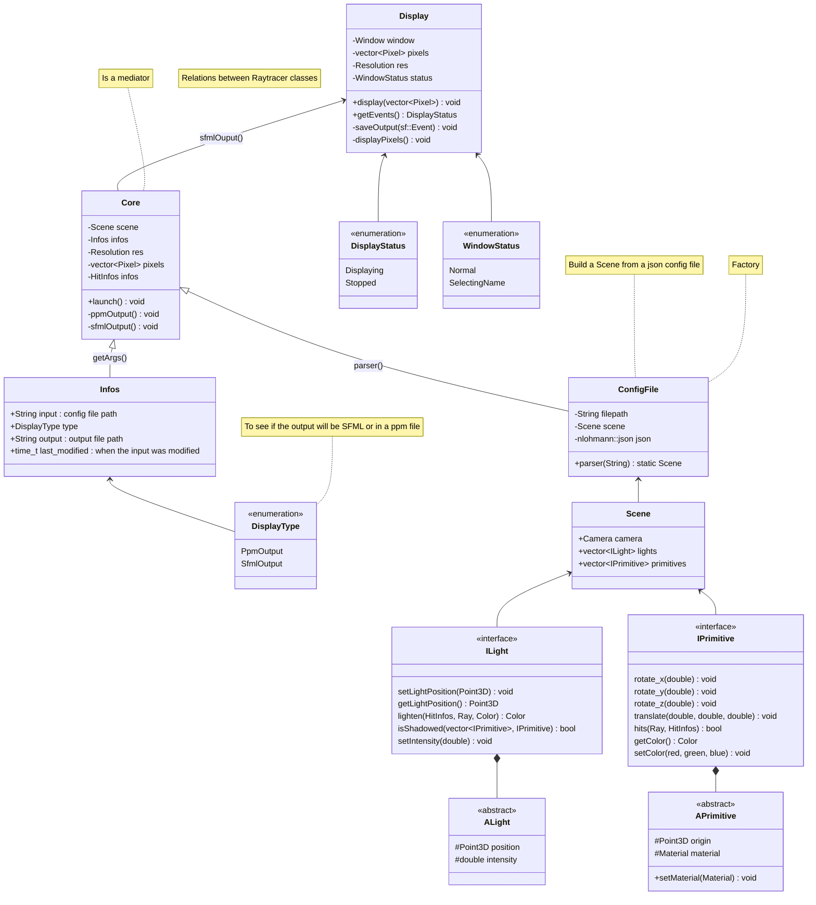

# Raytracer - Relation between classes

```mermaid
classDiagram
    note "Relations between Raytracer classes"
    Core <|-- Infos : getArgs()
    Core <|-- ConfigFile : parser()
    note for Core "Is a mediator"
    class Infos {
        +String input : config file path
        +DisplayType type
        +String output : output file path
        +time_t last_modified : when the input was modified
    }
    class DisplayType {
        <<enumeration>>
        PpmOutput
        SfmlOutput
    }
    note for DisplayType "To see if the output will be SFML or in a ppm file"
    Infos <-- DisplayType
    class ConfigFile {
        -String filepath
        -Scene scene
        -nlohmann::json json
        +parser(String) static Scene
    }
    ConfigFile <-- Scene
    note for ConfigFile "Factory"
    note for ConfigFile "Build a Scene from a json config file"
    class Scene {
        +Camera camera
        +vector~ILight~ lights
        +vector~IPrimitive~ primitives
    }
    class Core {
        -Scene scene
        -Infos infos
        -Resolution res
        -vector~Pixel~ pixels
        -HitInfos infos
        +launch() void
        -ppmOutput() void
        -sfmlOutput() void
    }
    class ILight {
        <<interface>>
        setLightPosition(Point3D) void
        getLightPosition() Point3D
        lighten(HitInfos, Ray, Color) Color
        isShadowed(vector~IPrimitive~, IPrimitive) bool
        setIntensity(double) void
    }
    class IPrimitive {
        <<interface>>
        rotate_x(double) void
        rotate_y(double) void
        rotate_z(double) void
        translate(double, double, double) void
        hits(Ray, HitInfos) bool
        getColor() Color
        setColor(red, green, blue) void
    }
    Scene <-- ILight
    Scene <-- IPrimitive
    ILight *-- ALight
    IPrimitive *-- APrimitive
    class ALight {
        <<abstract>>
        #Point3D position
        #double intensity
    }
    class APrimitive {
        <<abstract>>
        #Point3D origin
        #Material material
        +setMaterial(Material) void
    }
    Display <-- Core : sfmlOuput()
    class Display {
        -Window window
        -vector~Pixel~ pixels
        -Resolution res
        -WindowStatus status
        +display(vector~Pixel~) void
        +getEvents() DisplayStatus
        -saveOutput(sf::Event) void
        -displayPixels() void
    }
    Display <-- DisplayStatus
    class DisplayStatus {
        <<enumeration>>
        Displaying
        Stopped
    }
    Display <-- WindowStatus
    class WindowStatus {
        <<enumeration>>
        Normal
        SelectingName
    }
```
